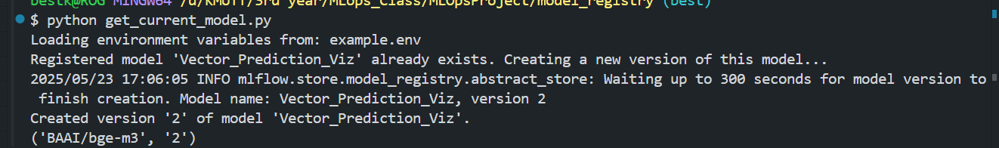

# approach for benchmarking the model
- llm topic -> n cluster -> compare cluster number
- human labelling -> n_cluster compare, regex matching

# overall flow
1. load data test
2. load currentodel
3. if perf drop tosome thredshod
4. refit
5. updte to best model
6. generate report of model comparison

# to run
1. cd to this folder 
2. docker compose -f docker_compose.yaml up
3. run your code
  - to run test on current model: model_trial.py
  
  - to get hf repo of current productiion model: registry.py
  